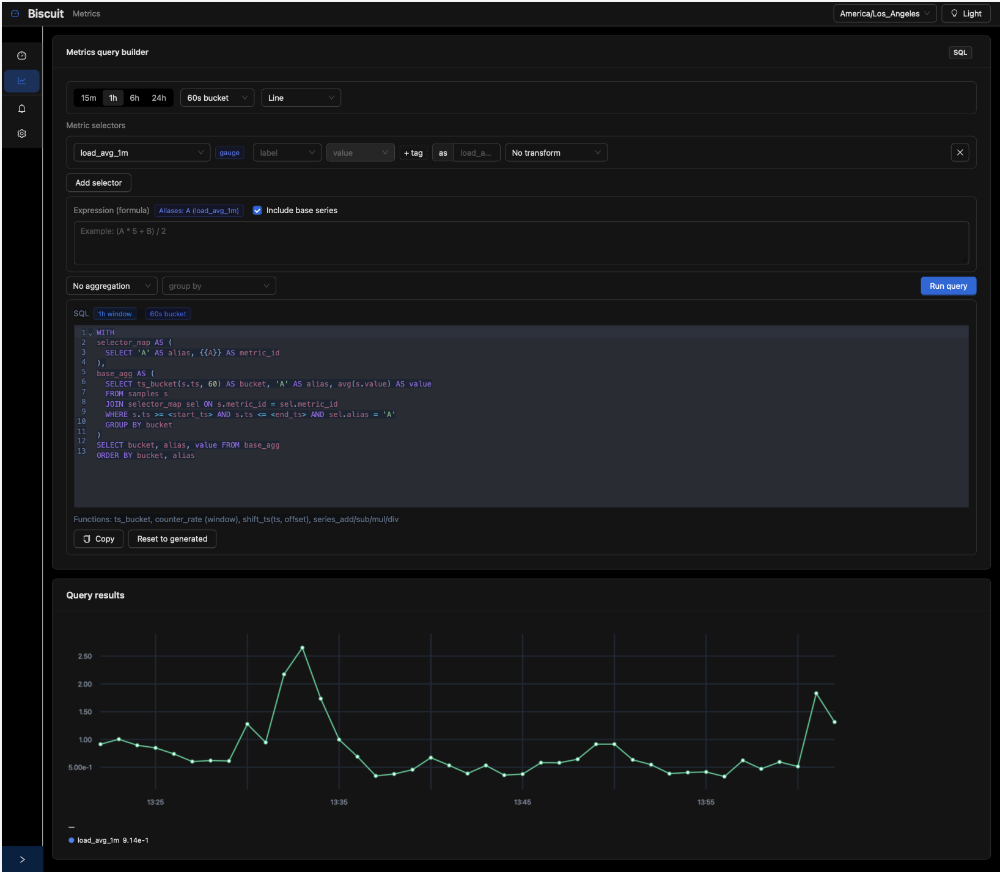

### Everything in this repo except this statement is 99% codex. Use at your own risk.

# Biscuit - a tsdb 

Minimal time-series storage built on FoundationDB with a ring buffer per metric and a DataFusion-powered SQL surface.



## Zero-to-cURL quick start

This is the fastest way to experience the system: launch the Podman image, POST a few samples, and run a SQL query.


1. **Build and start the container**

   ```bash
   podman build -t tsdb-proto .
   podman run --rm -it \
     --privileged \
     --security-opt seccomp=unconfined \
     -p 8000:8000 \
     -v "$(pwd):/workspace:z" \
     tsdb-proto
   ```

   The container brings up FoundationDB, the FastAPI server, and the demo collector under runit. Port `8000` now exposes the API to your host. The first startup spends a few seconds auto-configuring FoundationDB (`configure new single memory`), so wait until the logs go quiet before sending requests.

2. **Send a gauge datapoint**

   ```bash
   API=http://127.0.0.1:8000
   curl -s "$API/ingest/gauge" \
     -H "Content-Type: application/json" \
     -d "{\"name\":\"cpu_percent\",\"ts\":$(date +%s),\"value\":37.5,\"tags\":{\"host\":\"demo\"}}"
   ```

3. **Look up the metric_id**

   Requires `jq`; alternatively inspect the JSON manually.

   ```bash
   metric_id=$(curl -s "$API/metrics/lookup" \
     -H "Content-Type: application/json" \
     -d '{"name":"cpu_percent"}' | jq -r '.metrics[0].metric_id // empty')
   if [ -z "$metric_id" ]; then
     echo "metric cpu_percent not found (did ingest succeed?)"
     exit 1
   fi
   echo "metric_id=$metric_id"
   ```

4. **Query the samples with SQL**

   ```bash
   start_ts=$(( $(date +%s) - 600 ))
   end_ts=$(date +%s)
   curl -s "$API/query" \
     -H "Content-Type: application/json" \
     -d "{\"metric_ids\":[$metric_id],\"start_ts\":$start_ts,\"end_ts\":$end_ts,\"sql\":\"SELECT ts, value FROM samples WHERE metric_id = $metric_id ORDER BY ts\"}" \
     | jq
   ```

   Swap in your own SQL (`ts_bucket`, `bucket_rate`, and friends are registered) or hit `/metrics/$metric_id/series` for pre-bucketed JSON.

5. **Open the UI**

   Visit [http://127.0.0.1:8000/ui](http://127.0.0.1:8000/ui) in your browser to explore dashboards that read from the same API.

Shutdown the container with `Ctrl+C` when finished.

## How it works

The system stores metric samples in a bounded ring per metric (tuple key `(1, metric_id, slot)`), metadata in `(2, metric_id)`, and counter state in `(3, metric_id)`. Each metric keeps `slots` samples where `slot = (ts // step) % slots`, so storage stays constant over time. Gauges keep raw values, counters keep cumulative values, and `bucket_rate` derives per-bucket rates at query time. Retention is explicit (no TTLs); delete or rewrite metrics via the API when needed.

### Design highlights (see `DESIGN.md` for full rationale)

- Fixed-size rings mean storage is bounded by construction (`num_metrics × slots × record_size`).
- Writes overwrite existing slots instead of appending, so reducing traffic immediately reduces pressure.
- There are no TTLs/compactions/deletes—old data is naturally overwritten on schedule.
- FoundationDB handles durability/replication; DataFusion handles SQL, letting the two evolve independently.
- Backpressure is predictable: overload shows up as latency, not surprise disk or compaction spikes.

For deeper reasoning, tradeoffs, and comparisons to other TSDB models, read [`DESIGN.md`](DESIGN.md).

### Available endpoints

- `POST /ingest/gauge` – `{ "metric_id"?, "name"?, "ts", "value", "tags"?, "step"?, "slots"? }`
- `POST /ingest/counter` – `{ "metric_id"?, "name"?, "ts", "raw_value", "tags"?, "step"?, "slots"? }`
- `POST /query` – `{ "metric_ids": [...], "start_ts", "end_ts", "sql" }`; tables: `samples`, `metrics`, `metric_tags`; UDFs: `ts_bucket`, `bucket_rate`, `clamp`, `align_time`, `null_if_outside`, `series_add/sub/mul/div`
- `GET /metrics` – list metric metadata
- `POST /metrics/lookup` – match name/tags
- `GET /metrics/{metric_id}/series` – pre-bucketed time series (uses `bucket_rate` for counters)
- `POST /metrics/{metric_id}/retention` – gauges-only rewrite `{ "step": int, "slots": int }`
- `DELETE /metrics/{metric_id}` – drop metric + values
- Dashboards live under `/ui` with `GET/POST /dashboards`


## Sample queries
Raw samples:

```sql
SELECT ts, value FROM samples WHERE metric_id = 42 ORDER BY ts;
```

```sql
WITH
selector_map AS (
  SELECT 'A' AS alias, {{A}} AS metric_id
),
base_agg AS (
  SELECT ts_bucket(s.ts, 60) AS bucket, 'A' AS alias, avg(s.value) AS value
  FROM samples s
  JOIN selector_map sel ON s.metric_id = sel.metric_id
  WHERE s.ts >= <start_ts> AND s.ts <= <end_ts> AND sel.alias = 'A'
  GROUP BY bucket
)
SELECT bucket, alias, value FROM base_agg
ORDER BY bucket, alias
```

`QueryEngine` registers `ts_bucket` automatically before executing SQL.

## Tests

```bash
.venv/bin/python tests.py
```

The suite covers ring-buffer round trips, counter-rate detection, and SQL queries. Tests skip automatically if FoundationDB is unreachable.

## Repository tips

- Root entry points: `api.py` (FastAPI), `demo.py` (ingestion/query flow), `tests.py` (unittests)
- Persistence logic lives in `tsdb_fdb.py`; SQL orchestration and UDF registration live in `query_engine.py`
- Shared config lives in `config/`; container assets under `docker/` and `Dockerfile`
- Store `fdb.cluster` in the repo root or reference it via `FDB_CLUSTER_FILE`
